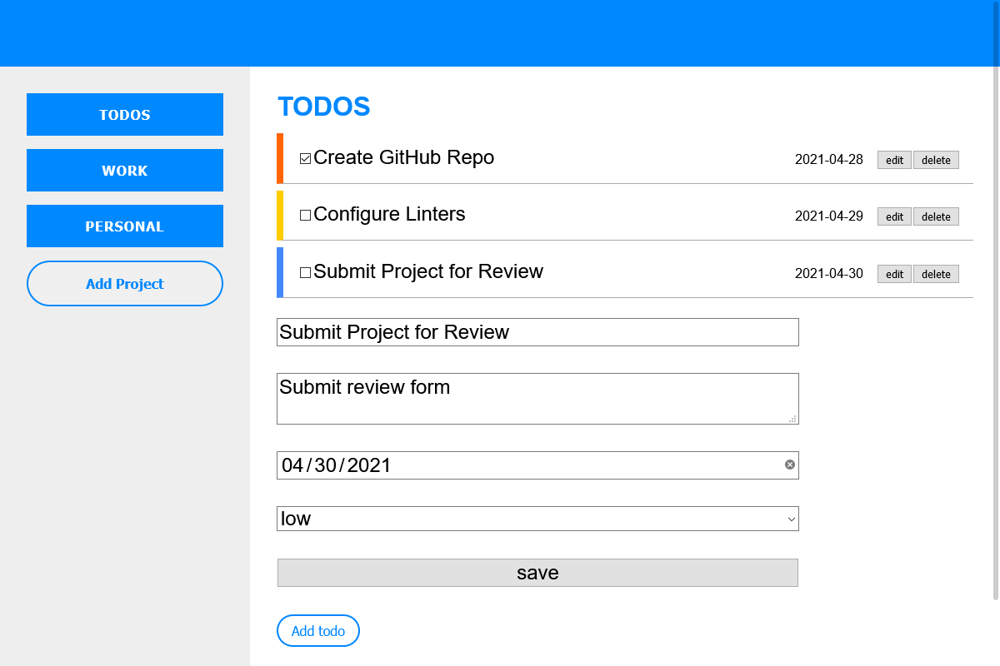

# Todo List

> A customizable todo list app for tasks and projects.



This project is intended to make use of JavaScript classes and modules for manipulating elements and content, as well as Webpack for module bundle. It makes use of:
- Classes to create specialized object instances
- Modular programming with JavaScript ES6 Modules
- Content entirely generated by JavaScript
- Webpack to bundle modules and assets
- Separation of logic and DOM elements creation

## Built With

- HTML & CSS
- JavaScript
- Webpack

## Live Demo

[Live Demo Link](https://brenoxav.github.io/todo-list/)

## Getting Started

To get a local copy up and running follow these simple example steps.

### Prerequisites

- A web browser

### Setup

- Clone or download the project to your local machine

- Change to the project's root directory
```
todo-list
```

- Open the `index.html` file on your preferred browser
```
/dist/index.html
```
- Helpful scripts:
  - To run in development mode and watch for changes:
  ```
  npm run dev-watch
  ```
  - To compile in development mode:
  ```
  npm run dev
  ```
  - To compile in production mode:
  ```
  npm run build
  ```
  - To open in browser with development mode:
  ```
  npm run start
  ```

## Authors

👨‍💻 **Breno Xavier**

- GitHub: [@brenoxav](https://github.com/brenoxav)
- Twitter: [@brenoxav](https://twitter.com/brenoxav)
- LinkedIn: [Breno Xavier](https://linkedin.com/in/brenoxav)

👩‍💻 **Mohamed Sabry**

- GitHub: [@mohamedSabry0](https://github.com/mohamedSabry0)
- Twitter: [@mohsmh0](https://twitter.com/mohsmh0)
- LinkedIn: [Mohamed Sabry](https://linkedin.com/in/mohamed-sabry0/)

## 🤝 Contributing

Contributions, issues, and feature requests are welcome!

Feel free to check the [issues page](issues/).

## Show your support

Give a ⭐️ if you like this project!

## Acknowledgments

- Odin Project
- Microverse
